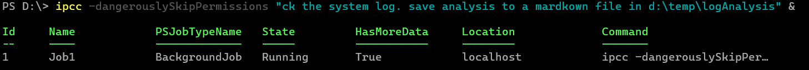
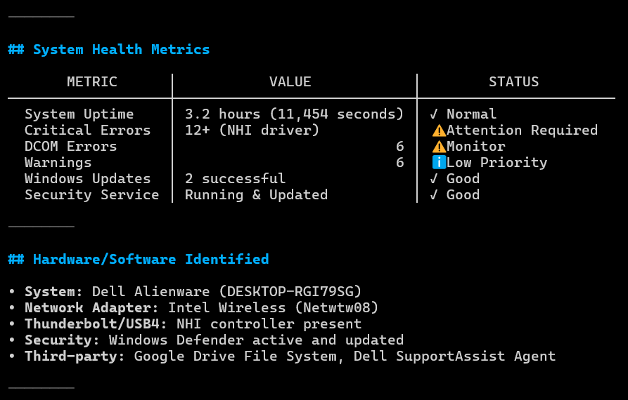

<p align="center">
  
</p>

<p align="center">
  <a href="https://x.com/dfinke">
    </a>
  <a href="https://youtube.com/@dougfinke">
    </a>
</p>
<br/>
<br/>

# PSClaudeCode

Ever wondered how AI agents like Claude Code work their magic? Dive into this PowerShell implementation and build your own intelligent assistant from scratch!

Inspired by the original [Claude Code article](https://x.com/dabit3/status/2009668398691582315?s=20), this project demonstrates how to create a PowerShell AI agent using Anthropic's Claude API. Start with a simple command runner and evolve it into a sophisticated agent with function calling, file operations, and conversational capabilities.

# In Action

Demo: the agent reads monthly CSV sales files and autonomously creates quarterly Excel workbooks using the ImportExcel module. The agent has no built-in logic for CSVs or Excel. It figures out what to do through iteration and tool use.

<div align="center">
  <a href="https://www.youtube.com/watch?v=7choAjuJ2BA">
    
  </a>
</div>

## Working Examples

This shows PSClaudeCode in action, showcasing the AI agent's ability to autonomously analyze logs, extract insights, and generate structured reports through iterative tool use.

```powershell
ipcc -dangerouslySkipPermissions "ck the system log. save analysis to a mardkown file in d:\temp\logAnalysis" &
```

### Agent Creating Log Analysis Report
This screenshot shows the AI agent autonomously processing a log file, extracting key insights, and generating a structured analysis report. The agent uses iterative tool calls to read the file, analyze patterns, and create meaningful output without any hardcoded logic for log processing.

**Note**: The `&` symbol creating this as a background job. This demonstrates "parallel" agent execution.



### Sample Log Section
This image displays a sample section of the log file being analyzed, showing the raw data format that the agent works with. It demonstrates how the agent can handle various text-based inputs and adapt its analysis approach accordingly.



The examples above highlight how the agent can handle complex, multi-step tasks without predefined logic, adapting to the specific requirements of log analysis and reporting.

## Table of Contents
- [Working Examples](#working-examples)
- [Features](#features)
- [Prerequisites](#prerequisites)
- [Installation](#installation)
- [Usage](#usage)
- [Examples](#examples)
- [Agent Evolution](#agent-evolution)
- [Contributing](#contributing)
- [License](#license)

## Features
- **PowerShell Module**: Properly structured module with `Invoke-PSClaudeCode` cmdlet
- **Agent Loop**: Iterative task completion with AI-driven decision making
- **Structured Tools**: Function calling for file operations (read/write) and command execution
- **Permission Checks**: Safe operations with user confirmation for dangerous actions
- **Model Selection**: Configurable Claude model selection via parameters
- **Sub-agent Support**: Delegates complex tasks to specialized sub-agents
- **PowerShell Native**: Built entirely in PowerShell, compatible with Anthropic Claude API
- **Progressive Complexity**: Three agent versions showing evolution from simple to advanced
- **Comment-Based Help**: Full PowerShell help documentation with `Get-Help Invoke-PSClaudeCode`
- **Pipeline Input Support**: Accept context via pipeline for enhanced task descriptions

## Prerequisites
- PowerShell 5.1 or higher
- Anthropic API key (set as environment variable `$env:ANTHROPIC_API_KEY`)

## Installation
1. Clone the repository:
   ```powershell
   git clone https://github.com/dfinke/PSClaudeCode.git
   cd PSClaudeCode
   ```

2. Set your Anthropic API key:
   ```powershell
   $env:ANTHROPIC_API_KEY = "your-api-key-here"
   ```

3. Import the module:
   ```powershell
   Import-Module .\PSClaudeCode.psd1
   ```

   Or install it permanently:
   ```powershell
   # Copy to PowerShell modules directory
   $modulePath = "$env:USERPROFILE\Documents\PowerShell\Modules\PSClaudeCode"
   New-Item -ItemType Directory -Path $modulePath -Force
   Copy-Item -Path "PSClaudeCode.psd1" -Destination $modulePath
   Copy-Item -Path "PSClaudeCode.psm1" -Destination $modulePath
   Copy-Item -Path "Public\*" -Destination $modulePath -Recurse
   Import-Module PSClaudeCode
   ```

## Usage
After importing the module, use the `Invoke-PSClaudeCode` cmdlet or its alias `ipcc`:

```powershell
Invoke-PSClaudeCode -Task "List all PowerShell files in this directory"
# or
ipcc -Task "List all PowerShell files in this directory"
```

### Getting Help
The cmdlet includes comprehensive comment-based help:

```powershell
Get-Help Invoke-PSClaudeCode
Get-Help Invoke-PSClaudeCode -Examples
Get-Help Invoke-PSClaudeCode -Parameter Task
```

### Parameters
- **`-Task`**: The task description for the AI agent to complete (required)
- **`-Model`**: The Claude model to use (optional, defaults to "claude-sonnet-4-5-20250929")
- **`-dangerouslySkipPermissions`**: Switch to bypass user confirmation prompts for dangerous operations (use with caution)
- **Pipeline Input**: Accepts pipeline input as additional context for the task

### Examples
```powershell
# Basic usage with default model
Invoke-PSClaudeCode -Task "Create a new file called 'test.txt' with 'Hello, World!'"

# Specify a different model
Invoke-PSClaudeCode -Task "List all files in the current directory" -Model "claude-3-5-sonnet-20241022"

# Bypass permission checks (use with caution)
Invoke-PSClaudeCode -Task "Delete all .tmp files in the current directory" -dangerouslySkipPermissions
```

The repository also includes three standalone agent script implementations of increasing complexity (these use OpenAI API for reference):

- `agent-v0.ps1`: Simple single-command agent (uses OpenAI)
- `agent-v1.ps1`: Looping agent with JSON-based responses (uses OpenAI)
- `agent-v2.ps1`: Advanced agent with structured tools and function calling (uses OpenAI)

Run any agent script directly:
```powershell
.\agent-v0.ps1 "List all PowerShell files in this directory"
```

## Examples

### Basic File Operations
```powershell
Invoke-PSClaudeCode -Task "Create a new file called 'test.txt' with the content 'Hello, World!', then read it back and display the contents."
```

### Command Execution with Safety Checks
```powershell
Invoke-PSClaudeCode -Task "List all files in the current directory and count how many there are"
# Agent will request permission for any potentially dangerous commands
```

### Pipeline Input Examples
```powershell
# Use file content directly as the task
Get-Content "data.txt" | Invoke-PSClaudeCode

# Provide context with a specific task
Get-Content "error.log" | Invoke-PSClaudeCode -Task "Analyze these error logs and identify the root cause"

# Process multiple files as context
Get-ChildItem "*.json" | Get-Content | Invoke-PSClaudeCode -Task "Compare these JSON configurations and highlight differences"
```

### Using Different Models
```powershell
# Use Claude 3.5 Sonnet
Invoke-PSClaudeCode -Task "Analyze the PowerShell scripts in this directory" -Model "claude-3-5-sonnet-20241022"

# Use the latest Claude Sonnet (default)
Invoke-PSClaudeCode -Task "Create a summary of all .md files in the repository"
```

### Pipeline Input for Context
The cmdlet now supports pipeline input to provide additional context:

```powershell
# Use file content as the task
Get-Content "data.txt" | Invoke-PSClaudeCode

# Combine task with piped context
Get-Content "logfile.txt" | Invoke-PSClaudeCode -Task "Analyze this log file and create a summary report"

# Process multiple files
Get-ChildItem "*.csv" | Get-Content | Invoke-PSClaudeCode -Task "Analyze these CSV files and identify trends"
```

### Legacy Script Examples
The standalone agent scripts are still available for reference:

#### Agent v0 - Simple Command Runner
```powershell
.\agent-v0.ps1 "list all PowerShell files in this directory"
# AI suggests: Get-ChildItem *.ps1
# Run this command? (y/n)
```

#### Agent v1 - Looping Agent
```powershell
.\agent-v1.ps1 "List all files in the current directory and count how many there are"
# Agent will run commands iteratively until task is complete
```

#### Agent v2 - Function Calling Agent
```powershell
.\agent-v2.ps1 "Create a new file called 'test.txt' with the content 'Hello, World!', then read it back and display the contents."
# Agent uses structured tools for file operations and command execution
```

## Agent Evolution
Check out the [step-by-step guide](reference/2026-01-10-Building-PowerShell-AI-Agent-From-Scratch-to-Claude-Code.md) to understand the evolution from basic to advanced agent implementations.

## Contributing
Contributions are welcome! Please feel free to submit a Pull Request.

## Be Sure to Check out

- [dfinke/psai](https://github.com/dfinke/psai): PSAI brings the power of autonomous agents to PowerShell, allowing you to seamlessly integrate AI capabilities into your scripts and terminal workflows.
- [dfinke/psaisuite](https://github.com/dfinke/psaisuite): Simple, unified interface to multiple Generative AI providers including OpenAI, Anthropic, and others. PSAISuite makes it easy for developers to use multiple LLMs through a standardized interface.

## License
This project is licensed under the MIT License - see the LICENSE file for details.
